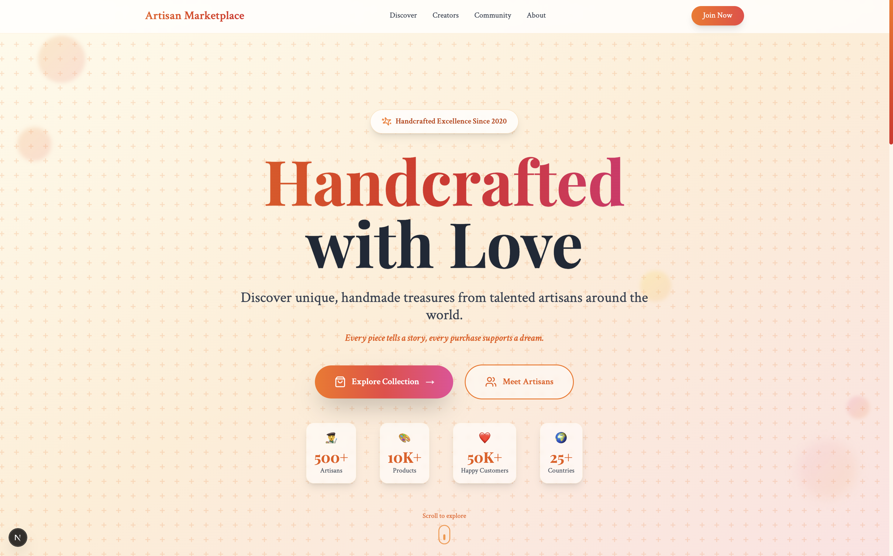

# Artisan Marketplace - Handmade Goods Landing Page

A warm, texture-rich landing page for a handmade goods marketplace that connects creators with customers who value authentic, artisanal products. The design emphasizes craftsmanship, community, and the human stories behind each handmade item.

## Features

- Warm, earthy color palette with terracotta and beige tones
- Interactive product grid with hover effects showcasing handmade items
- Creator spotlight section with circular profile images and artisan stories
- Community-focused messaging highlighting the human element
- Tactile design with subtle paper textures and hand-drawn elements
- Product categories navigation (Pottery, Textiles, Jewelry, Home Decor)
- Featured artisan profiles with their craft stories
- Responsive design optimized for all devices

## Design Preview



The landing page showcases:
- Hero section celebrating handmade craftsmanship
- Featured products grid with authentic artisan photography
- Creator stories section highlighting the people behind the products
- Community-driven marketplace experience
- Warm, inviting aesthetic that feels tactile and authentic

## Key Sections

- **Hero**: "Discover Authentic Handmade Treasures" with featured product carousel
- **Product Categories**: Pottery, Textiles, Jewelry, Home Decor, Art
- **Featured Artisans**: Creator profiles with their craft stories
- **Community**: Customer testimonials and artisan success stories
- **How It Works**: Simple 3-step process for buyers and sellers

## Color Palette

- **Primary**: Terracotta (#E07A5F)
- **Secondary**: Warm Beige (#F4F3EE)
- **Accent**: Deep Clay (#A0522D)
- **Text**: Charcoal (#3C3C3C)
- **Highlights**: Sage Green (#9CAF88)

## Tech Stack

- Next.js 14 with TypeScript
- Tailwind CSS
- Shadcn/ui components
- Framer Motion for product hover animations
- Adobe Stock imagery for authentic artisan photography

## Getting Started

```bash
npm install
npm run dev
```

Open [http://localhost:3000](http://localhost:3000) to view the landing page.

## Adobe Stock Asset Requirements

- Artisan workshop photography
- Handmade product close-ups
- Creator portrait photos
- Craft process images
- Textural backgrounds (paper, linen, wood)

## License

MIT License
